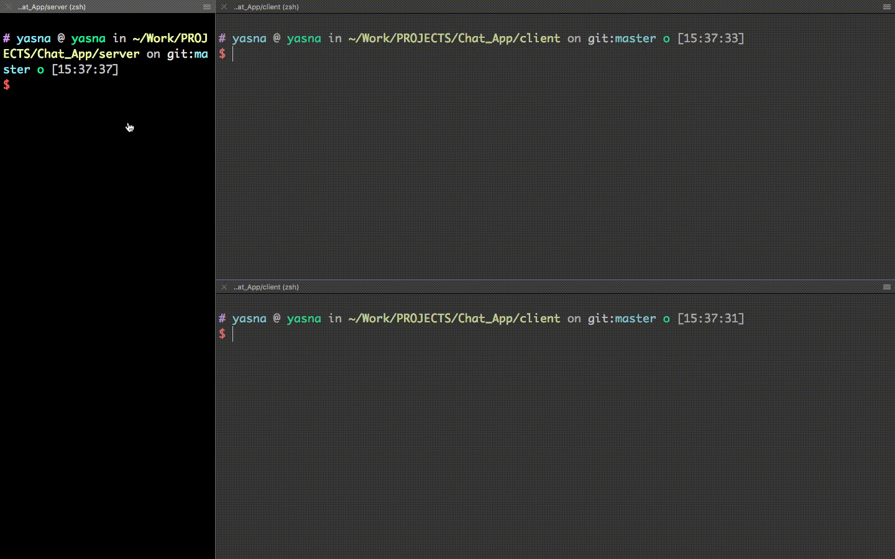

# Chatroom
🏁🔮  The goal of this project is writing a simple  chatroom (server-client) in Rust.
## Dependencies

### macOS
This project needs the Rust compiler (rustc) and the Rust package manager (cargo).

### Building on macOS
#### Rust Installation :
 For installation it's advised to use rustup.
 
  	 $ brew install rustup

Use rustup to install the Rust compiler and the Rust package manager.
	
    $ rustup-init

1. Clone the repository.
2. Change the directory to server.
3. Run  <code>$ cargo run</code> 
4. Change the directory to client.
5. Run  <code>$ cargo run</code> 
6. Write your messages !

📌📌📌  If you try to send a message that's longer than 32 bytes it doesn't actually break anything. It just cuts off the message at 32 bytes.

